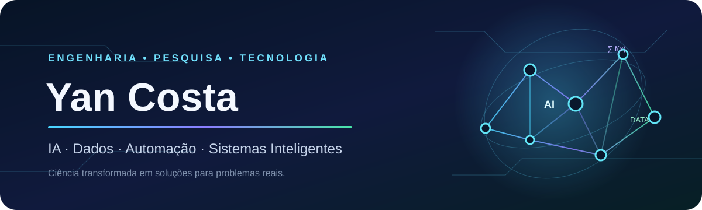
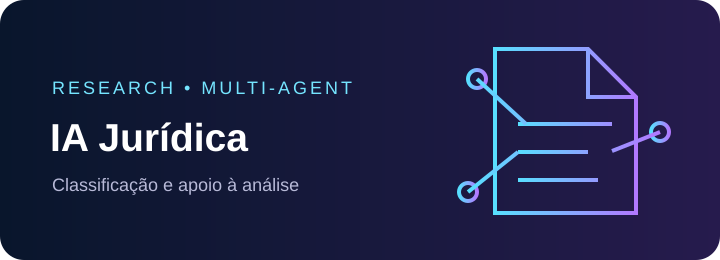
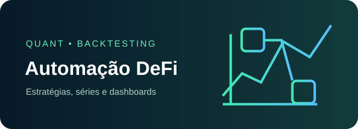
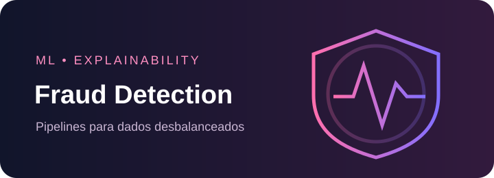
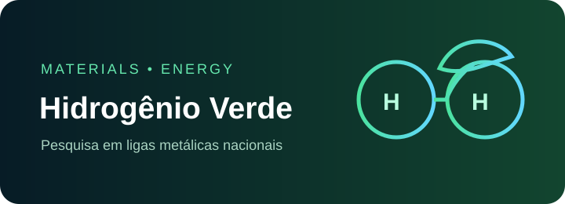
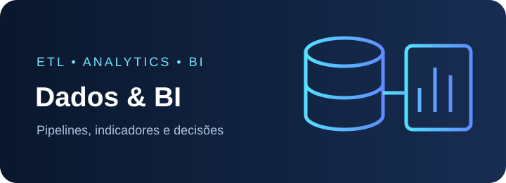

<!--
  PERFIL DE YAN COSTA
  Username configurado: YanCarneosso. Procure pelos demais marcadores "SEU_".
  Links profissionais e de projetos: atualize os hrefs abaixo.
  Apresentação: edite o parágrafo logo após o typing SVG.
  Tecnologias: edite as tabelas da seção "Tecnologias e ferramentas".
  Novo projeto: copie um bloco <td> da seção "Projetos em destaque".
  Imagens em assets/ são locais; typing, badges e estatísticas dependem de serviços externos.
-->

  

  <!-- EXTERNO: fallback textual disponível logo abaixo -->
  

<strong>AI Researcher · Machine Learning · Data Engineering · Intelligent Systems · Automation · Engineering Physics</strong>

<!-- APRESENTAÇÃO: altere este texto mantendo-o breve. -->

  Engenheiro Físico pela UNILA, pesquisador em Inteligência Artificial e mestrando em Engenharia de Sistemas e Automação na UFLA. Desenvolvo soluções que conectam dados, machine learning, automação e agentes inteligentes a desafios reais de ciência e engenharia.

<!-- LINKS: substitua todos os placeholders SEU_ antes de publicar. -->

  
  
  
  
  
  

## Sobre mim

<table>
  <tr>
    <td>📍 <strong>Brasil</strong></td>
    <td>🎓 Mestrado em Engenharia de Sistemas e Automação — UFLA</td>
  </tr>
  <tr>
    <td>🔬 Pesquisa aplicada e desenvolvimento tecnológico</td>
    <td>🧠 Experiência com dados, IA, ETL, Python e Power BI</td>
  </tr>
  <tr>
    <td>🤝 Aberto a colaboração científica e open source</td>
    <td>🌎 Português · Espanhol · Inglês em desenvolvimento</td>
  </tr>
</table>

Minha atuação combina pensamento científico, construção de sistemas e análise orientada por dados. Interesso-me especialmente por agentes de IA, RAG, sistemas multiagentes, engenharia do conhecimento, DeFi e automação financeira.

## Áreas de atuação

<table>
  <tr>
    <td align="center"></td>
    <td align="center"></td>
    <td align="center"></td>
    <td align="center"></td>
  </tr>
  <tr>
    <td align="center"></td>
    <td align="center"></td>
    <td align="center"></td>
    <td align="center"></td>
  </tr>
  <tr>
    <td align="center"></td>
    <td align="center"></td>
    <td align="center"></td>
    <td align="center"></td>
  </tr>
</table>

## Tecnologias e ferramentas

<!-- TECNOLOGIAS: inclua ou remova itens mantendo as categorias. -->
| Categoria | Stack |
|---|---|
| **Linguagens** | Python · SQL · DAX · Bash · Markdown · LaTeX |
| **Dados & Machine Learning** | Pandas · NumPy · Scikit-learn · XGBoost · SHAP · Matplotlib · Jupyter · SMOTE |
| **Engenharia de Dados & BI** | Power BI · SQL Server · ETL · modelagem de dados · pipelines · visualização |
| **Inteligência Artificial** | Ollama · Open WebUI · RAG · LanceDB · embeddings · modelos locais · FastAPI · agentes de IA |
| **Desenvolvimento & Infra** | Git · GitHub · Linux · Arch Linux · Docker · APIs REST · VS Code |

<table>
  <tr>
    <td align="center" width="11%"> Python</td>
    <td align="center" width="11%"> Pandas</td>
    <td align="center" width="11%"> NumPy</td>
    <td align="center" width="11%"> Scikit-learn</td>
    <td align="center" width="11%"> FastAPI</td>
    <td align="center" width="11%"> Docker</td>
    <td align="center" width="11%"> Git</td>
    <td align="center" width="11%"> Linux</td>
    <td align="center" width="11%"> VS Code</td>
  </tr>
</table>

## Projetos em destaque

<!-- PROJETOS: substitua SEU_REPOSITORIO_* e SEU_*_ARTIGO_DEMO. Para adicionar outro, copie um <td>. -->
<table>
  <tr>
    <td width="50%" valign="top">
      
      <h3>Vault Mind</h3>
      
Agente cognitivo local que registra conversas, indexa notas e recupera contexto por uma API de memória persistente.

      
<strong>Problema:</strong> preservar e recuperar conhecimento entre interações com modelos locais.

      
<code>Python</code> <code>FastAPI</code> <code>Ollama</code> <code>RAG</code> <code>LanceDB</code> <code>Obsidian</code>

      
<strong>Status:</strong> em desenvolvimento

      
<a href="SEU_REPOSITORIO_VAULT_MIND">Repositório</a> · <a href="SEU_VAULT_MIND_DEMO">Demo/Docs</a>

    </td>
    <td width="50%" valign="top">
      
      <h3>Agente de IA para instrumentos jurídicos</h3>
      
Pesquisa de mestrado para classificar documentos, apoiar caminhos legais e produzir relatórios com arquitetura multiagente.

      
<strong>Problema:</strong> tornar a análise de contratos e instrumentos de parceria mais estruturada e rastreável.

      
<code>Python</code> <code>Random Forest</code> <code>ETL</code> <code>NLP</code> <code>Top-1/3</code> <code>Macro-F1</code> <code>MRR</code>

      
<strong>Status:</strong> pesquisa em andamento

      
<a href="SEU_REPOSITORIO_LEGAL_AI">Repositório</a> · <a href="SEU_LEGAL_AI_ARTIGO">Artigo/Docs</a>

    </td>
  </tr>
  <tr>
    <td width="50%" valign="top">
      
      <h3>Automação financeira em DeFi</h3>
      
TCC sobre análise quantitativa, backtesting, SMA, EMA e LSMA, drawdown, livro de ordens e integração com DEX.

      
<strong>Problema:</strong> avaliar e automatizar estratégias financeiras sobre séries temporais.

      
<code>Python</code> <code>DeFi</code> <code>Backtesting</code> <code>DEX</code> <code>Dashboards</code>

      
<strong>Status:</strong> trabalho acadêmico concluído

      
<a href="SEU_REPOSITORIO_DEFI">Repositório</a> · <a href="SEU_DEFI_ARTIGO_DEMO">TCC/Demo</a>

    </td>
    <td width="50%" valign="top">
      
      <h3>Machine Learning para detecção de fraudes</h3>
      
Pipeline para dados desbalanceados com feature engineering, reamostragem e explicabilidade.

      
<strong>Problema:</strong> identificar eventos raros sem mascarar o desempenho das classes minoritárias.

      
<code>SMOTE</code> <code>Random Forest</code> <code>XGBoost</code> <code>Logistic Regression</code> <code>ROC/PR</code> <code>SHAP</code>

      
<strong>Status:</strong> projeto aplicado

      
<a href="https://github.com/YanCarneosso/fraud-detection-ml">Repositório</a> · <a href="SEU_FRAUDES_DEMO">Demo/Docs</a>

    </td>
  </tr>
  <tr>
    <td width="50%" valign="top">
      
      <h3>Pesquisa em hidrogênio verde</h3>
      
Investigação da substituição de platina por ligas metálicas nacionais em aplicações para produção de hidrogênio.

      
<strong>Problema:</strong> explorar materiais alternativos para tecnologias de energia limpa.

      
<code>Engenharia Física</code> <code>Materiais</code> <code>Energia</code> <code>Pesquisa experimental</code>

      
<strong>Status:</strong> pesquisa acadêmica reconhecida com menção honrosa

      
<a href="SEU_REPOSITORIO_HIDROGENIO">Materiais</a> · <a href="SEU_HIDROGENIO_ARTIGO">Artigo/Apresentação</a>

    </td>
    <td width="50%" valign="top">
      
      <h3>Dashboards & Engenharia de Dados</h3>
      
Pipelines, modelos e indicadores para automatizar relatórios e apoiar análise temporal e tomada de decisão.

      
<strong>Problema:</strong> transformar dados dispersos em informação confiável e acionável.

      
<code>Power BI</code> <code>DAX</code> <code>SQL Server</code> <code>ETL</code> <code>Python</code> <code>Data Modeling</code>

      
<strong>Status:</strong> experiência profissional e projetos

      
<a href="SEU_REPOSITORIO_DADOS">Repositório</a> · <a href="SEU_DADOS_DEMO">Dashboard/Docs</a>

    </td>
  </tr>
</table>

## Pesquisa e formação

| Etapa | Percurso |
|---|---|
| 🎓 **Engenharia Física — UNILA** | Formação interdisciplinar em ciência, engenharia e tecnologia |
| 🔬 **Pesquisa e extensão** | Participação em iniciação científica, projetos de pesquisa, extensão e divulgação científica |
| ⚗️ **Hidrogênio verde** | Pesquisa sobre ligas metálicas nacionais como alternativa à platina |
| 📈 **Trabalho de conclusão** | Automação financeira em DeFi, análise quantitativa e séries temporais |
| 🎓 **Mestrado — UFLA** | Engenharia de Sistemas e Automação |
| 🧠 **Pesquisa atual** | Inteligência artificial aplicada à análise de instrumentos jurídicos |

## Reconhecimentos

- Menção honrosa por trabalho relacionado ao hidrogênio verde.
- Menção honrosa por projeto de extensão e divulgação científica.
- Participação em projetos acadêmicos, tecnológicos e de inovação.
- Atuação em liderança e representação estudantil.

## Estatísticas do GitHub

<!-- LOCAL: este card não depende de serviços externos de estatísticas. -->

  

| Explorar | Link oficial |
|---|---|
| 📂 Repositórios públicos | [Ver projetos e linguagens](https://github.com/YanCarneosso?tab=repositories) |
| 🟩 Contribuições | [Ver calendário e atividade](https://github.com/YanCarneosso?tab=overview) |
| 🧪 Projeto de fraude em ML | [Abrir repositório](https://github.com/YanCarneosso/fraud-detection-ml) |

## Contribuições

<!-- LOCAL após a primeira execução do workflow: o arquivo será publicado na branch output. -->

  <picture>
    <source media="(prefers-color-scheme: dark)" srcset="https://raw.githubusercontent.com/YanCarneosso/YanCarneosso/output/github-contribution-grid-snake-dark.svg">
    <source media="(prefers-color-scheme: light)" srcset="https://raw.githubusercontent.com/YanCarneosso/YanCarneosso/output/github-contribution-grid-snake.svg">
    
  </picture>

> Fallback: consulte o [gráfico nativo de contribuições](https://github.com/YanCarneosso) no perfil. Para ativar a animação, habilite GitHub Actions e execute **Generate contribution snake** manualmente uma vez.

## Atualmente

- Desenvolvendo projetos com inteligência artificial e machine learning.
- Pesquisando sistemas inteligentes e IA aplicada ao mestrado.
- Aprimorando práticas de engenharia de dados.
- Construindo agentes de IA locais com memória e recuperação de contexto.
- Aberto a colaborações em pesquisa, dados, automação e inteligência artificial.

   
  <strong>“Transformando conhecimento científico em sistemas capazes de compreender, aprender e agir.”</strong>

  Tem uma ideia de pesquisa ou um problema interessante para resolver? 
  <strong>Vamos construir algo relevante juntos.</strong>

  <!-- Atualize manualmente quando fizer uma revisão relevante. -->
  Última atualização: julho de 2026 · Obrigado pela visita — Yan Costa

